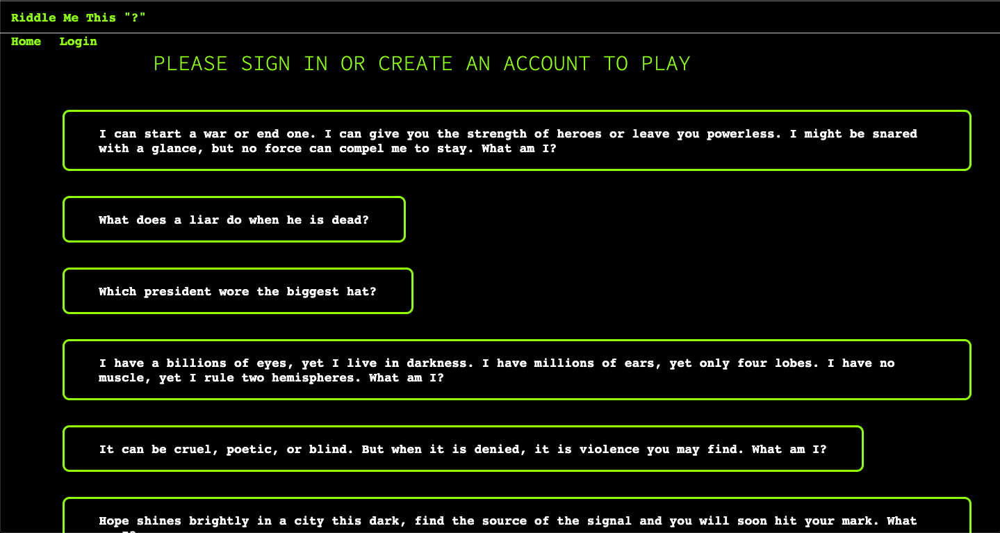

# Riddle Me This ?

## Description
Is a fun riddle game that can support strength problem solving, logic and critical thinking skills. Inspired by the Batman comics. 

## Tasks Completed
* Node.js and Express.js to create a RESTful API.
* Used Handlebars.js as the templating engine. 
* Used MYSQL and the Sequelize ORM for the database.
* Both GET and POST routes for retrieving and adding new data.
* Deployed using Heroku (with data).

## About the Webpage
Riddle Me This is a riddle game. Using riddles from the movie Batman. A fun riddle game that can support problem solving, logic and critical thinking skills.
  
## Contributors
* [Alvin Badillo](https://github.com/defhook)
* [Rodrigo Valencia](https://github.com/Rodrigo-Valencia)
* [Michael Ramos](https://github.com/MichaelR432)
* [Hector Palacios](https://github.com/Paquito81)

### Links
* [Github Link](https://github.com/Rodrigo-Valencia/Riddle-Me-This.git)
* [Deployed Link](https://morning-sierra-98445.herokuapp.com/)

### Reference 

